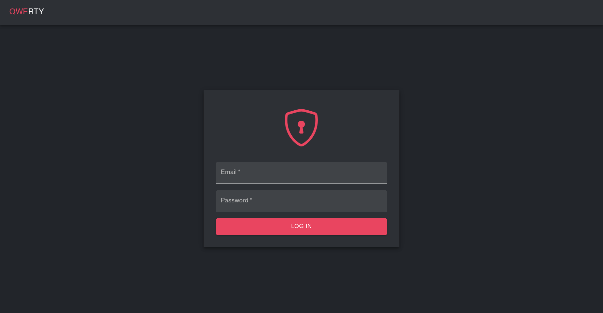
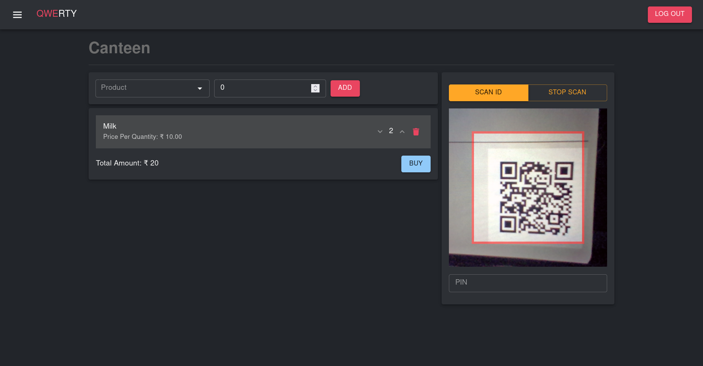
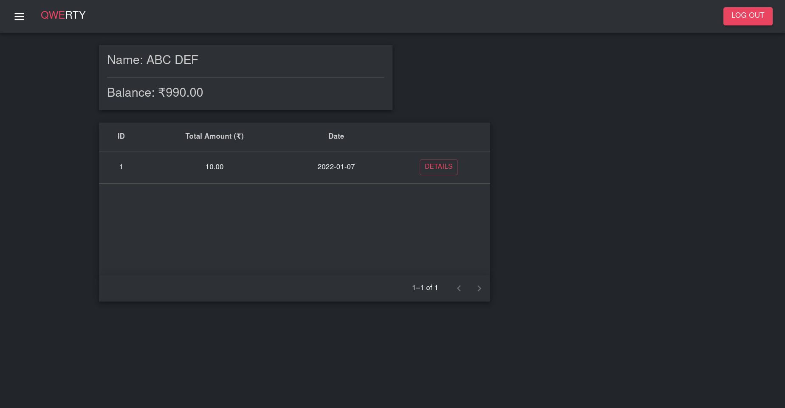
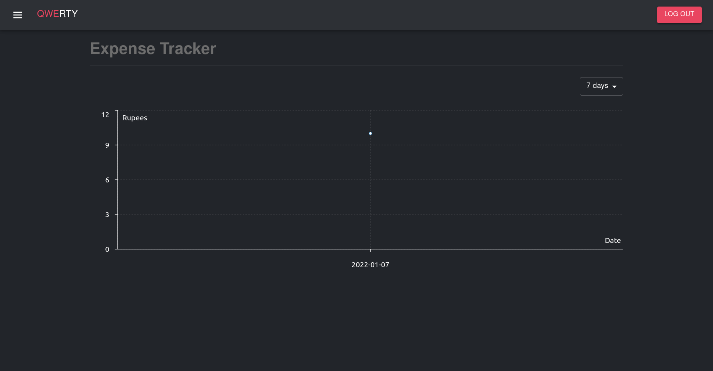
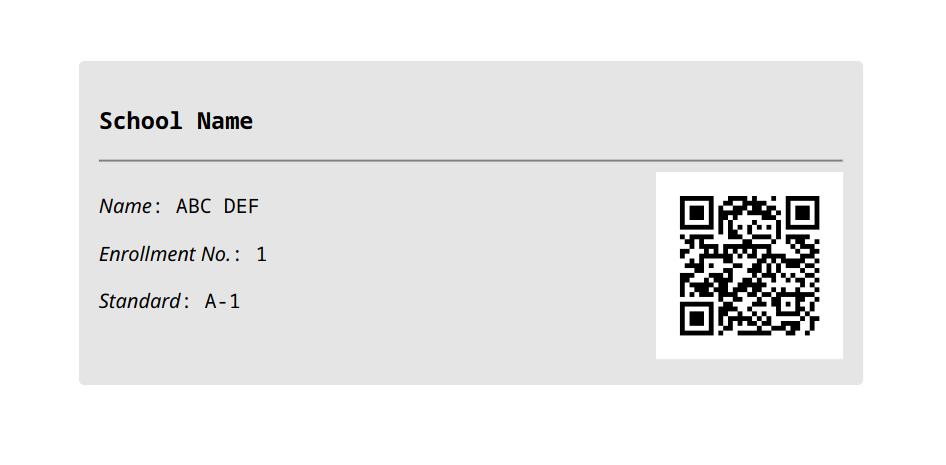

# Qwerty

This Web application can be used in Schools and colleges. Basically, a student will be able to perform any type of transaction related to purchase in canteen, stationary or transportation facilty with the qrcode present on his/her ID card. The student has to enter their pin number for performing a purchase.

Each students are given a dashboard to keep track of their transaction. The dashboard also provides visualization of expenditure and calorie in-take of the student.

The staff of the institute are provided a manager account for performing the transactions. Staff can also access the django admin CMS for creation of new accounts or registering new products and to generate a pdf file containing the ID cards of the students.

### LOGIN PAGE

### Manager Dashboard

### Student Dashboard

### Expense tracker for students

### Generated ID of student

